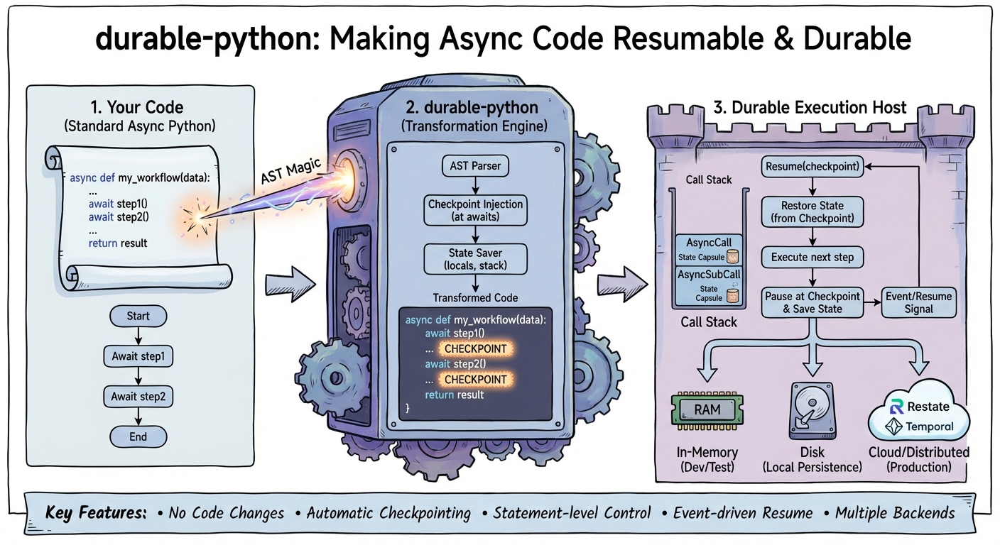

<div align="center">

[](https://pypi.org/project/durable-python/)
[](https://www.python.org/)
[](https://github.com/playbooks-ai/durable-python/blob/main/LICENSE)

<!-- [](https://playbooks-ai.github.io/playbooks-docs/) -->
<!-- [](https://deepwiki.com/playbooks-ai/playbooks) -->
[](https://github.com/playbooks-ai/durable-python/actions/workflows/test.yml)
[](https://github.com/playbooks-ai/durable-python/actions/workflows/lint.yml)
<!-- [](https://github.com/playbooks-ai/durable-python/issues) -->
<!-- [](https://github.com/playbooks-ai/durable-python/blob/main/CONTRIBUTING.md) -->
<!-- [](https://github.com/playbooks-ai/durable-python/graphs/contributors) -->

<!-- [](https://runplaybooks.ai/) -->
</div>

# durable-python

Make Python async functions durable and resumable with a minimal, pluggable runtime.

## Overview



This package treats durability as a core runtime concern. Async functions are transformed into a sequence of `CodeBlock`s that can be checkpointed, paused, and resumed through a `DurableRuntime`. Everything is open and pluggable: orchestration backends implement a small interface, and persistence is provided through `StateStore` implementations.

Key primitives:
- `DurableRuntime` — drives execution and persistence.
- `CallStack` / `FunctionCall` / `CodeBlock` — durable execution model.
- `OrchestrationBackend` / `DurableBackend` — orchestration + event waiting.
- `StateStore` / `InMemoryStateStore` / `DiskStateStore` — persistence.
- `DurableAstTransformer` / `make_durable` — transform async functions into durable programs.

## Quick Start

```python
import asyncio
from durable import DurableBackend, InMemoryStateStore, PauseForEventException, make_durable

# Define your async function
async def greet(name: str):
    print("waiting for permission to greet")
    raise PauseForEventException("allow")
    return f"hello {name}"

# Make it durable
durable_greet = make_durable(greet)

async def main():
    backend = DurableBackend(InMemoryStateStore())

    async def run_once():
        # Triggers runtime execution; will pause on PauseForEventException
        try:
            return await durable_greet("Ada", orchestration_backend=backend, instance_id="greet-1")
        except PauseForEventException as e:
            print(f"paused for event {e.event}")

    await run_once()                 # pauses and persists state
    backend.publish_event("greet-1", "allow")  # deliver event
    result = await durable_greet("Ada", orchestration_backend=backend, instance_id="greet-1")
    print(result)                    # "hello Ada"

asyncio.run(main())
```

## Architecture

- **Execution model:** `FunctionCall` holds locals, an ordered list of `CodeBlock`s, and the current index. `CallStack` orchestrates nested calls and return propagation.
- **Durable runtime:** `DurableRuntime` restores saved state (if any), drives the call stack, and delegates persistence plus event waiting to an `OrchestrationBackend`.
- **Backends:** `OrchestrationBackend` defines `load_state`, `save_state`, and `wait_for_event`. `DurableBackend` is the OSS implementation backed by a `StateStore` and an in-memory event bus.
- **Persistence:** `StateStore` defines `load` / `save`. The OSS package ships `InMemoryStateStore` and `DiskStateStore(path)`.
- **Transformation:** `DurableAstTransformer` rewrites async functions into checkpointable code. `make_durable(fn)` wraps a function into a `DurableProgram` that builds a runtime and executes it.

## Custom Backends

Implement `OrchestrationBackend` to integrate with your own orchestration layer:

```python
from durable import OrchestrationBackend

class CustomBackend(OrchestrationBackend):
    async def load_state(self, instance_id: str) -> dict | None:
        ...

    async def save_state(self, instance_id: str, state: dict) -> None:
        ...

    async def wait_for_event(self, instance_id: str, event_name: str) -> None:
        ...
```

Use it by passing `orchestration_backend=` to the callable returned by `make_durable`.

## Testing

Install dev dependencies and run pytest:

```bash
poetry install --with dev
poetry run pytest
```
